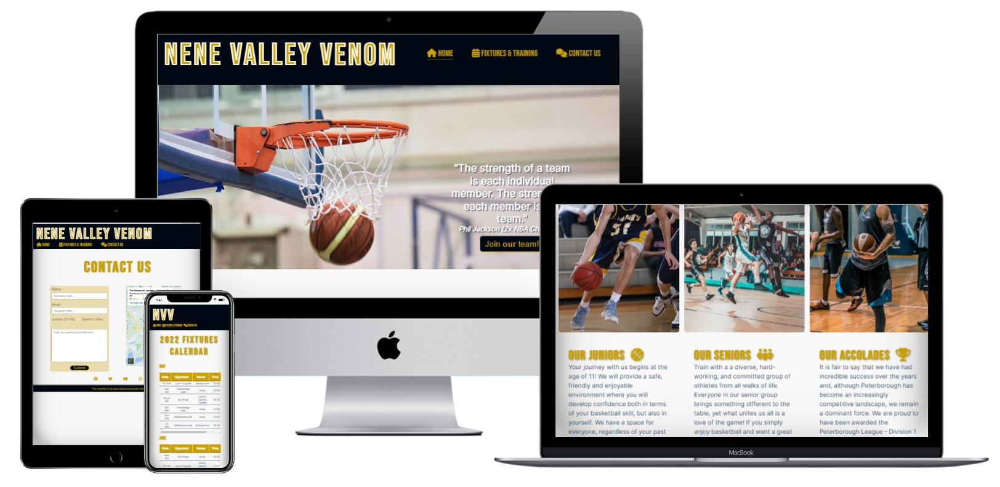
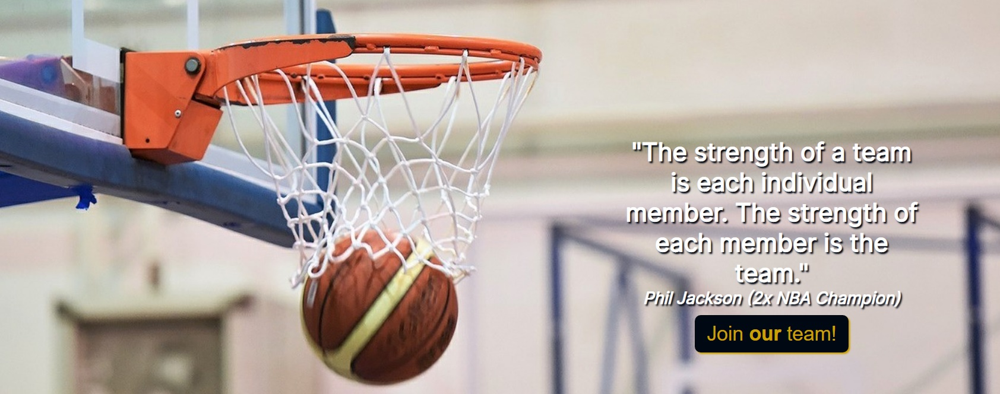
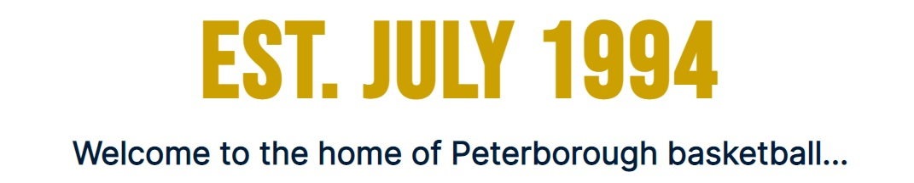
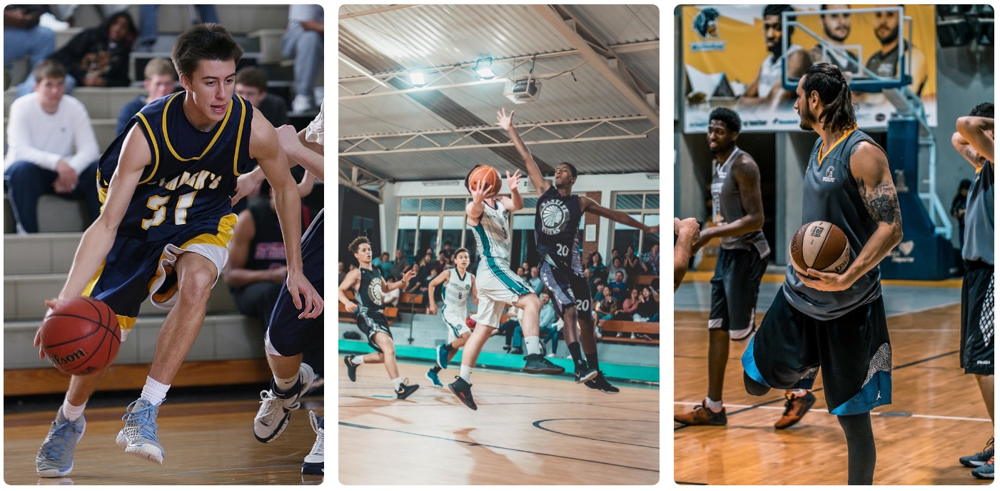
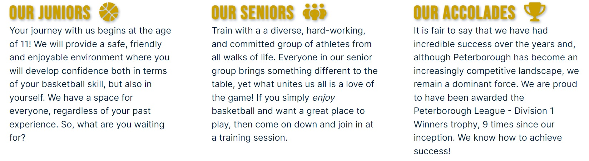
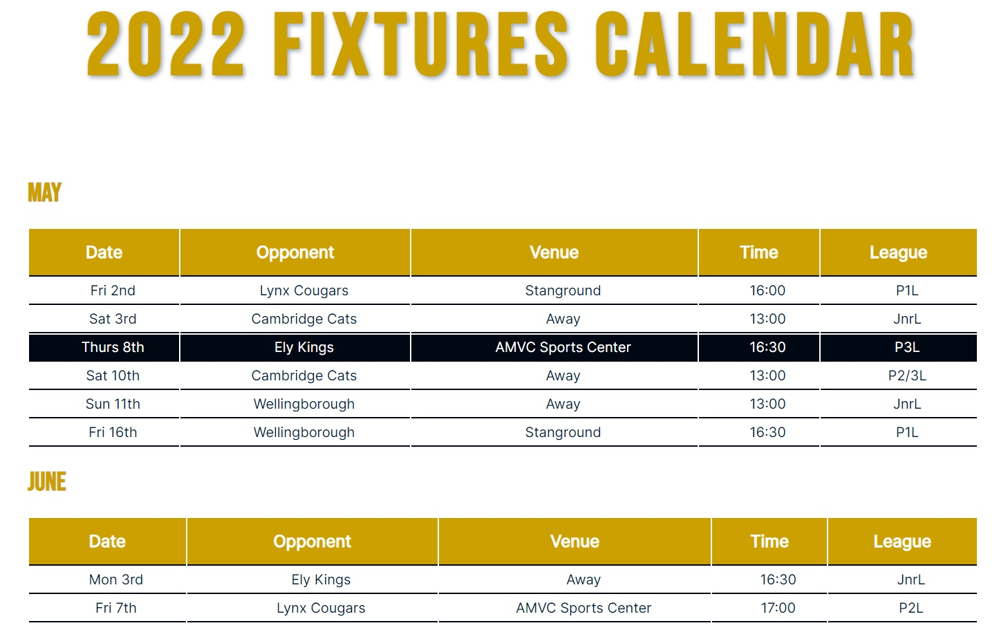
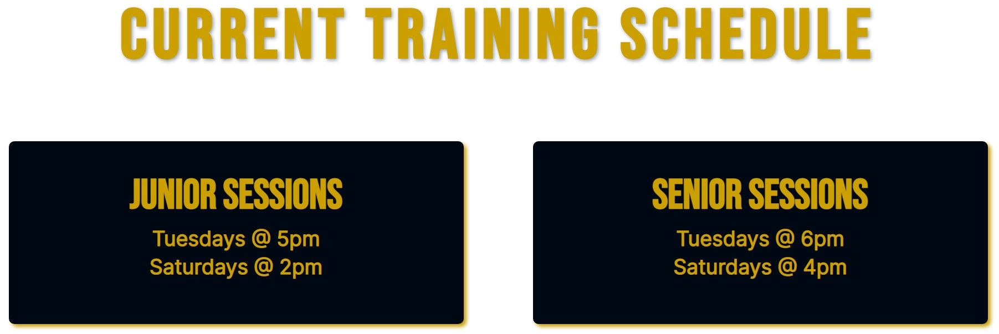

<h1 align="center"> :basketball: Nene Valley Venom Basketball Club Website :basketball: </h1>

[View the live project here](http://nickdevc.github.io/Nene_Valley_Basketball/)

Nene Valley Basketball Club is a real sports club based in Peterborough, UK. The club has been a big part of the local basketball scene for many years and provides training for both junior and senior players. Having spoken to the owner and head coach of the club, I was kindly given permission to create a new website for them that would be functional for existing members, whilst also remaining accessible and eye-catching to new potential players.

## Index - Table of Contents
*  [Purpose](#purpose)
*  [User Experience (UX)](#user-experience-ux)
*  [Features](#features)
*  [Design](#design)
*  [Technologies Used](#technologies-used)
*  [Testing](#testing)
*  [Deployment](#deployment)
*  [Credits](#credits)

## Purpose

The purpose of the website is two-fold:

### 1 - Existing players
To provide an easily acessible space for existing players to engage with their club; allowing quick access to contact details and relevant, live training/fixtures information

### 2 - New players
To provide an engaging and appealing space to prospective players, encouraging them to make contact with the club and attend a training session. They need to get a clear sense of brand identity, club ethos, and quickly access a method of communication.

## User Experience (UX)

-  ### User Stories
   
   -  #### 1) First Time Visitor Goals
      
      1. I want to easily understand and access the main purpose of the site
      2. I want to be able to easily learn more about the organisation represented on the site
      3. I want to be able to quickly and effectively navigate around the site, viewing basic club information and training schedules
      4. I want to be able to easily access the location of the organisation
      5. I want to be able to quickly and efficiently contact the organisation, to request a callback or ask a question
   
   -  #### 2) Returning Visitor Goals
   
      1. I want to be able to access and navigate the menu quickly and efficiently
      2. I want to be able to easily check and compare upcoming fixture dates
      3. I want to be able to quickly contact the organisation with queries
   
   -  #### 3) Frequent User Goals

      1. I want to be able to sign-up to the mailing list for regular club updates

## Features

   ### Existing Features
      
-   __Navigation Bar__

    - The navigation bar has a consistent look and placement on all three pages of the website supporting easy navigation.  It includes a simple Logo, Home page, Fixtures and Training, and Contact links and is responsive on multiple screen sizes.  On medium sized screens (smaller laptops or ipads), the navigation menu moves to under the logo. On small screen sizes (mobile phones), the logo is abbreviated to ensure legibility, accessibility and effective use of space.

      

-   __Home page - Hero image and call to action__

    - The landing page consists of a large, iconic hero image, an overlaying inspiration quote, and a button that sends the user to the contacts page.
    - The image is instantly recognisable, identifying the focus of the website, whilst also conveying a sense of action with the slight zoom animation when the page is loaded by the user.
    - The overlaying text is designed to engage with users by encouraging them to consider one of the key ethos of the club: teamwork. The text section has been designed to be legible and accessible on all devices with responsive designs in place.
    - In addition to this, the button (which links directly to the Contact Us page) then encourages the user to make contact and engage directly with the club by opening communication channels (signing up new members is one of the fundamental purposes of the website).

      
      
-   __Home page - Tagline__

    - In order to seperate the hero image from the additional 'about' section, I decided to include a tagline to establish the club's prominant position in the local area. It includes an established date and the location.
    - The tagline is bold, with no additional imagery that could otherwise distract the user from firm message being conveyed.  

      
      
-   __Home page - About section__

    - The about section is designed to give first or returning users the chance to get a basic understanding or 'flavour' of the club.
    - Three action-driven images help to give the home page more life and vibrancy whilst acting as a window into what the club's day-to-day experience may look like for the user.
    - Three columns of text act to give the user more specific, detailed information about the clubs structure and their achievements (setting them apart from other competing institutions)
    - This section has been designed to be repsonsive, switching to a row structure on smaller screen sizes. 

      
      
      

-   __Footer__

    - The 

      
      
-   __Fixtures & Training page - Fixtures calendar__

    - The 

      
      
-   __FIxtures & Training page - Training schedule__

    - The 

      
      
-   __Contact Us page__

    - The 

      

   ### Potential Future Features

## Design

   ### Colour
   
   
   ### Typography
   
   
   ### Imagery
   
   
   ### Planning/wireframes 

## Technologies Used

## Testing

## Deployment

## Credits

-  ### Photos Used
-  Index.html 'hero image' - Photo from 'Pixabay'
-  Youth basketball image - Photo by <a href="https://unsplash.com/@tjump?utm_source=unsplash&utm_medium=referral&utm_content=creditCopyText">Nik Shuliahin</a> on <a href="https://unsplash.com/s/photos/youth-basketball?utm_source=unsplash&utm_medium=referral&utm_content=creditCopyText">Unsplash</a>
  

-  ### Specific Coding Support
-  'How to outline text' -SlackOverflow
-  'How to animate an image' - Love Running (Code Institute project)
  

  
